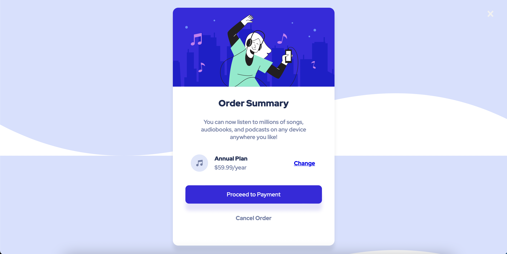

# Frontend Mentor - Order summary card solution

This is a solution to the [Order summary card challenge on Frontend Mentor](https://www.frontendmentor.io/challenges/order-summary-component-QlPmajDUj). Frontend Mentor challenges help you improve your coding skills by building realistic projects. 

## Table of contents

- [Overview](#overview)
  - [The challenge](#the-challenge)
  - [Screenshot](#screenshot)
  - [Links](#links)
- [My process](#my-process)
  - [Built with](#built-with)
  - [What I learned](#what-i-learned)
  - [Continued development](#continued-development)
- [Author](#author)


## Overview

This is a basic Order Summary, built with HTML and CSS. This is my second Frontendmentor challange, and there is definitely a lot of room for improvements.  
### The challenge

Users should be able to:

- View the optimal layout depending on their device's screen size
- See hover states for interactive elements

### Screenshot



### Links

- Solution URL: [GitHub Repository](https://github.com/d4wk0m/Order-Summary)
- Live Site URL: [Live Site](https://d4wk0m.github.io/Order-Summary/)

## My process

### Built with

- Semantic HTML5 markup
- CSS custom properties


### What I learned

I've learned how to make diffrent border-radious on specific corners. I've learned how to make basic buttons, and create shadows. 

```html
<section style="width: calc(100% - 100px);padding-bottom: 20px">
  <table style="width: 100%;padding-left: 15px;padding-right: 1px;">
      <tr>
          <td style="color:hsl(223, 47%, 23%);font-weight: 900;">Annual Plan</td>
          <td rowspan="2" style="text-align: right;"><a href="#" style="font-weight: 700;">Change</a></td>
      </tr>
      <tr>
          <td style="color: hsl(224, 23%, 55%);">$59.99/year</td>
      </tr>
  </table>
</section>
```
```css
.button {
    background-color: hsl(245, 75%, 52%);
    color: white;
    display: block;
    width: calc(100% - 100px);
    margin: auto;
    text-align: center;
    padding: 15px;
    border-radius: 10px;
    box-shadow: 0px 20px 10px hsla(245, 75%, 52%, 0.13);
    text-decoration: none;
    margin-bottom: 30px;
}
```


### Continued development

I will be focusing on using more flexbox and building more responsive websites

## Author

- Website - [Dawid Komęza](http://dkomeza.great-site.net)
- Frontend Mentor - [@d4wk0m](https://www.frontendmentor.io/profile/d4wk0m)
